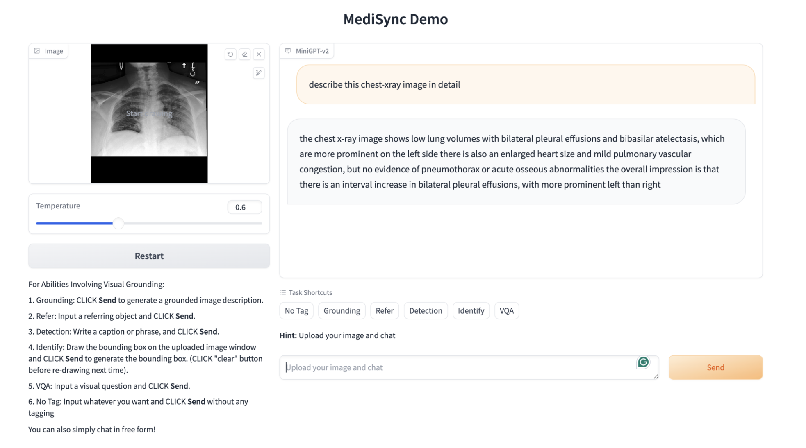
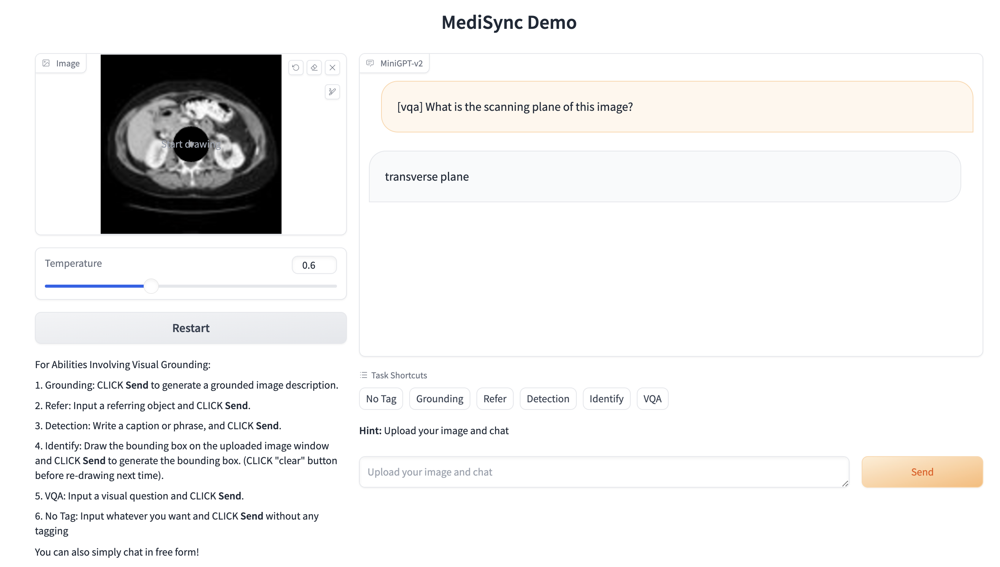

# MiniGPT-V

<font size='5'>**MediSync: Unified Model for VQA, Report Generation & Disease Detection**</font>

Khushbu Pahwa,RICE University (RICE ID : kp66)

<!-- ☨equal last author -->

<!-- <a href='https://minigpt-v2.github.io'></a> <a href='https://arxiv.org/abs/2310.09478.pdf'></a>  <a href='https://huggingface.co/spaces/Vision-CAIR/MiniGPT-v2'> <a href='https://minigpt-v2.github.io'></a> [](https://www.youtube.com/watch?v=atFCwV2hSY4) -->
<!-- 

<font size='5'> **MiniGPT-4: Enhancing Vision-language Understanding with Advanced Large Language Models**</font>

Deyao Zhu*, Jun Chen*, Xiaoqian Shen, Xiang Li, Mohamed Elhoseiny

*equal contribution

<a href='https://minigpt-4.github.io'></a>  <a href='https://arxiv.org/abs/2304.10592'></a> <a href='https://huggingface.co/spaces/Vision-CAIR/minigpt4'></a> <a href='https://huggingface.co/Vision-CAIR/MiniGPT-4'></a> [](https://colab.research.google.com/drive/1OK4kYsZphwt5DXchKkzMBjYF6jnkqh4R?usp=sharing) [](https://www.youtube.com/watch?v=__tftoxpBAw&feature=youtu.be)

*King Abdullah University of Science and Technology*

## 💡 Get help - [Q&A](https://github.com/Vision-CAIR/MiniGPT-4/discussions/categories/q-a) or [Discord 💬](https://discord.gg/5WdJkjbAeE)

<font size='4'> **Example Community Efforts Built on Top of MiniGPT-4 ** </font> 
  
* <a href='https://github.com/waltonfuture/InstructionGPT-4?tab=readme-ov-file'></a> **InstructionGPT-4**: A 200-Instruction Paradigm for Fine-Tuning MiniGPT-4 Lai Wei, Zihao Jiang, Weiran Huang, Lichao Sun, Arxiv, 2023

* <a href='https://openaccess.thecvf.com/content/ICCV2023W/CLVL/papers/Aubakirova_PatFig_Generating_Short_and_Long_Captions_for_Patent_Figures_ICCVW_2023_paper.pdf'></a> **PatFig**: Generating Short and Long Captions for Patent Figures.", Aubakirova, Dana, Kim Gerdes, and Lufei Liu, ICCVW, 2023 


* <a href='https://github.com/JoshuaChou2018/SkinGPT-4'></a> **SkinGPT-4**: An Interactive Dermatology Diagnostic System with Visual Large Language Model, Juexiao Zhou and Xiaonan He and Liyuan Sun and Jiannan Xu and Xiuying Chen and Yuetan Chu and Longxi Zhou and Xingyu Liao and Bin Zhang and Xin Gao,  Arxiv, 2023 


* <a href='https://huggingface.co/Tyrannosaurus/ArtGPT-4'></a> **ArtGPT-4**: Artistic Vision-Language Understanding with Adapter-enhanced MiniGPT-4.",  Yuan, Zhengqing, Huiwen Xue, Xinyi Wang, Yongming Liu, Zhuanzhe Zhao, and Kun Wang, Arxiv, 2023 


</font>

## News
[Oct.31 2023] We release the evaluation code of our MiniGPT-v2.  

[Oct.24 2023] We release the finetuning code of our MiniGPT-v2.

[Oct.13 2023] Breaking! We release the first major update with our MiniGPT-v2

[Aug.28 2023] We now provide a llama 2 version of MiniGPT-4 -->

<!-- ## Online Demo

Click the image to chat with MiniGPT-v2 around your images
[](https://minigpt-v2.github.io/)

Click the image to chat with MiniGPT-4 around your images
[](https://minigpt-4.github.io)
 -->

## MediSync Examples





<!-- 
## MiniGPT-4 Examples
  |   |   |
:-------------------------:|:-------------------------:
 |  
  |   -->

<!-- More examples can be found in the [project page](https://minigpt-4.github.io). -->


## Getting Started
### Installation

**1. Prepare the code and the environment**

Git clone our repository, creating a python environment and activate it via the following command

```bash
git clone https://github.com/kpahwa16/medisync_minigptv2.git
cd medisync_minigptv2
conda env create -f environment.yml
conda activate medisync
```


**2. Prepare the pretrained LLM weights**

**MiniGPT-v2** is based on Llama2 Chat 7B. For **MiniGPT-4**, we have both Vicuna V0 and Llama 2 version.
Download the corresponding LLM weights from the following huggingface space via clone the repository using git-lfs.

|                            Llama 2 Chat 7B                             |                                           Vicuna V0 13B                                           |                                          Vicuna V0 7B                                          |
:------------------------------------------------------------------------------------------------:|:----------------------------------------------------------------------------------------------:|:----------------------------------------------------------------------------------------------:
[Download](https://huggingface.co/meta-llama/Llama-2-7b-chat-hf/tree/main) | [Downlad](https://huggingface.co/Vision-CAIR/vicuna/tree/main) | [Download](https://huggingface.co/Vision-CAIR/vicuna-7b/tree/main) 


Then, set the variable *llama_model* in the model config file to the LLM weight path.

* For MiniGPT-v2, set the LLM path 
[here](medisync/configs/models/minigpt_v2.yaml#L15) at Line 14.

* For MiniGPT-4 (Llama2), set the LLM path 
[here](medisync/configs/models/minigpt4_llama2.yaml#L15) at Line 15.

* For MiniGPT-4 (Vicuna), set the LLM path 
[here](medisync/configs/models/minigpt4_vicuna0.yaml#L18) at Line 18

**3. Prepare the pretrained model checkpoints**

Download the pretrained model checkpoints


| MiniGPT-v2 (after stage-2) | MiniGPT-v2 (after stage-3) | MiniGPT-v2 (online developing demo)| 
|------------------------------|------------------------------|------------------------------|
| [Download](https://drive.google.com/file/d/1Vi_E7ZtZXRAQcyz4f8E6LtLh2UXABCmu/view?usp=sharing) |[Download](https://drive.google.com/file/d/1HkoUUrjzFGn33cSiUkI-KcT-zysCynAz/view?usp=sharing) | [Download](https://drive.google.com/file/d/1aVbfW7nkCSYx99_vCRyP1sOlQiWVSnAl/view?usp=sharing) |


For **MiniGPT-v2**, set the path to the pretrained checkpoint in the evaluation config file 
in [eval_configs/minigptv2_eval.yaml](eval_configs/minigptv2_eval.yaml#L10) at Line 8.


| MiniGPT-4 (Vicuna 13B) | MiniGPT-4 (Vicuna 7B) | MiniGPT-4 (LLaMA-2 Chat 7B) |
|----------------------------|---------------------------|---------------------------------|
| [Download](https://drive.google.com/file/d/1a4zLvaiDBr-36pasffmgpvH5P7CKmpze/view?usp=share_link) | [Download](https://drive.google.com/file/d/1RY9jV0dyqLX-o38LrumkKRh6Jtaop58R/view?usp=sharing) | [Download](https://drive.google.com/file/d/11nAPjEok8eAGGEG1N2vXo3kBLCg0WgUk/view?usp=sharing) |

For **MiniGPT-4**, set the path to the pretrained checkpoint in the evaluation config file 
in [eval_configs/minigpt4_eval.yaml](eval_configs/minigpt4_eval.yaml#L10) at Line 8 for Vicuna version or [eval_configs/minigpt4_llama2_eval.yaml](eval_configs/minigpt4_llama2_eval.yaml#L10) for LLama2 version.   


### Launching Demo Locally

For MediSync, run
```
python demo_medisync.py --cfg-path eval_configs/minigptv2_eval.yaml  --gpu-id 0
```
<!-- 
For MiniGPT-4 (Vicuna version), run

```
python demo.py --cfg-path eval_configs/minigpt4_eval.yaml  --gpu-id 0
```

For MiniGPT-4 (Llama2 version), run

```
python demo.py --cfg-path eval_configs/minigpt4_llama2_eval.yaml  --gpu-id 0
``` -->


To save GPU memory, LLMs loads as 8 bit by default, with a beam search width of 1. 
This configuration requires about 23G GPU memory for 13B LLM and 11.5G GPU memory for 7B LLM. 
For more powerful GPUs, you can run the model
in 16 bit by setting `low_resource` to `False` in the relevant config file:

* MiniGPT-v2: [minigptv2_eval.yaml](eval_configs/minigptv2_eval.yaml#6) 
* MiniGPT-4 (Llama2): [minigpt4_llama2_eval.yaml](eval_configs/minigpt4_llama2_eval.yaml#6)
* MiniGPT-4 (Vicuna): [minigpt4_eval.yaml](eval_configs/minigpt4_eval.yaml#6)


## Acknowledgement

+ [MiniGPT-v2](https://github.com/Vision-CAIR/MiniGPT-4.git) MediSync is based on MiniGPT-V2 architecture and stage 3 checkpoint is utilized for finetuning. 
+ [BLIP2](https://huggingface.co/docs/transformers/main/model_doc/blip-2) The model architecture of MiniGPT-4 follows BLIP-2. Don't forget to check this great open-source work if you don't know it before!
+ [Lavis](https://github.com/salesforce/LAVIS) This repository is built upon Lavis!
+ [Vicuna](https://github.com/lm-sys/FastChat) The fantastic language ability of Vicuna with only 13B parameters is just amazing. And it is open-source!
+ [LLaMA](https://github.com/facebookresearch/llama) The strong open-sourced LLaMA 2 language model.


